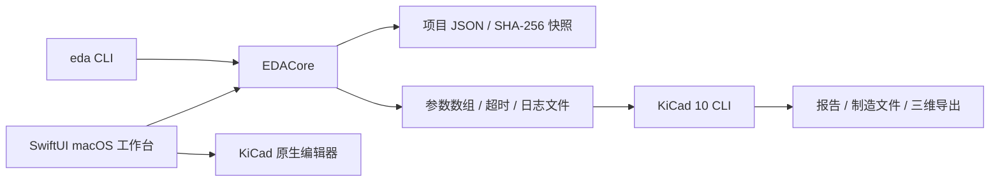
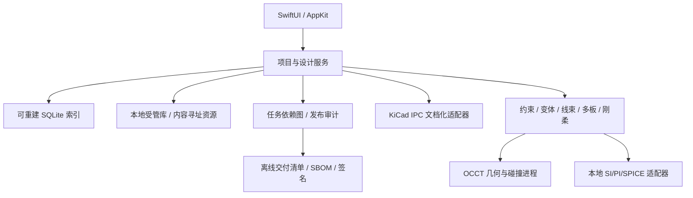

# 系统架构

## 已实现架构

工作台没有 HTTP/WebSocket 客户端或服务端。进程适配器直接运行本地二进制，使用参数数组避免 shell 注入，stdout/stderr 写临时文件防止管道缓冲死锁。检测超时后先 terminate，必要时 kill 并等待子进程退出。GUI 将耗时工作放到后台任务，不在主线程执行 DRC。

### 模块职责

|模块|责任|禁止行为|
|---|---|---|
|Models|schemaVersion、路径边界、元数据原子保存、BOM 分组|重写原理图或隐式改料|
|ProjectFiles|排除生成目录、复制前后哈希、快照校验|跟随符号链接把外部文件打包|
|Harness|连接器/针脚/导线数据与点对点检查|假定独立线束已同步 PCB|
|BoardPreview|有边界的 S-expression 解析和几何摘要|用于制造或电气拓扑判定|
|Engine|引擎探测、版本握手、CLI 作业、日志与超时|默认兼容未知主版本|
|Manufacturing|冻结、规则检查、证据校验、唯一发布目录|把失败输出标为 release|
|AppModel|最近项目、文件选择、后台作业、编辑器启动|上传项目或自动下载依赖|

### 设计权威与一致性

`.kicad_sch/.kicad_pcb/.kicad_pro` 是设计权威文件。工作台元数据、采购计划、线束资料独立存储。当前 DNP 仅作用于采购计划，原理图权威 BOM 独立导出。发布 DRC 包括 `--schematic-parity`，但程序不能代替器件电气、工艺能力和人工批准。

当前 Snapshot 将所有非生成源文件复制进不可变目录，并核对复制前后和目标的散列；恢复时用户复制 source 到新目录。复杂外部依赖尚未自动解析，不可宣称完整工程闭包。

## 目标架构（待实现）

1. 服务层使用 actor 隔离项目操作；每个项目单写者，读取使用明确 revision ID。
2. 原生设计文件保存后计算 design revision；所有结果绑定 revision、库锁文件、规则哈希和引擎版本。
3. 任务图按输入签名缓存，但任何门禁结果不得跨不同源/库/规则复用。
4. 几何、仿真、插件独立进程；崩溃或许可证缺失不会损坏原生项目。
5. IPC 支持启动握手、API 能力查询、事务回执和保存确认；不足的 API 继续走受审查 CLI 或原生 GUI。
6. SQLite WAL 用作索引与审阅事件存储；设计本身仍是开放文件。事务失败不改变审批状态。

### 高级模块依赖顺序

库锁定 → 项目闭包 → 正式变体 → 制造完整性；原生语义抽取 → 约束 → 高速求解；OCCT 模型 → 碰撞 → 多板/弯折；系统端口 → 线束/跨板 ECO。任何一个模块只提供 JSON 模型不算完成图形编辑/专业校核。

### 项目服务 API（目标）

`openProject(URL) -> Revision`；`scanDependencies(Revision) -> ClosureReport`；`proposeECO(ChangeSet) -> Preview`；`commitECO(Preview, expectedRevision)`；`runJob(JobSpec, Revision) -> JobID`；`approveRelease(Hash, Identity)`；`exportBundle(Revision, Lockfile)`。所有写入携带 expectedRevision，防止覆盖外部编辑器的新保存。

### 可替换组件

引擎通过协议提供探测/版本/能力/作业/编辑器接口；不得将 KiCad 内部未公开类直接嵌入 SwiftUI。三维/求解器也通过声明式输入文件与结果 schema 通信，选择后锁定版本和单位。任何生成规则/仿真约束回写先出差异预览。

### 已知工程债

工作台当前使用全文件读取、数组型采购计划和极简预览；大型工程需要流式解析/索引。作业暂不可主动取消；只有超时。外部库闭包/恢复事务/多层出图/完整 DFM/批准签名尚未实现。不得把这些债项隐去以宣称 90%。
